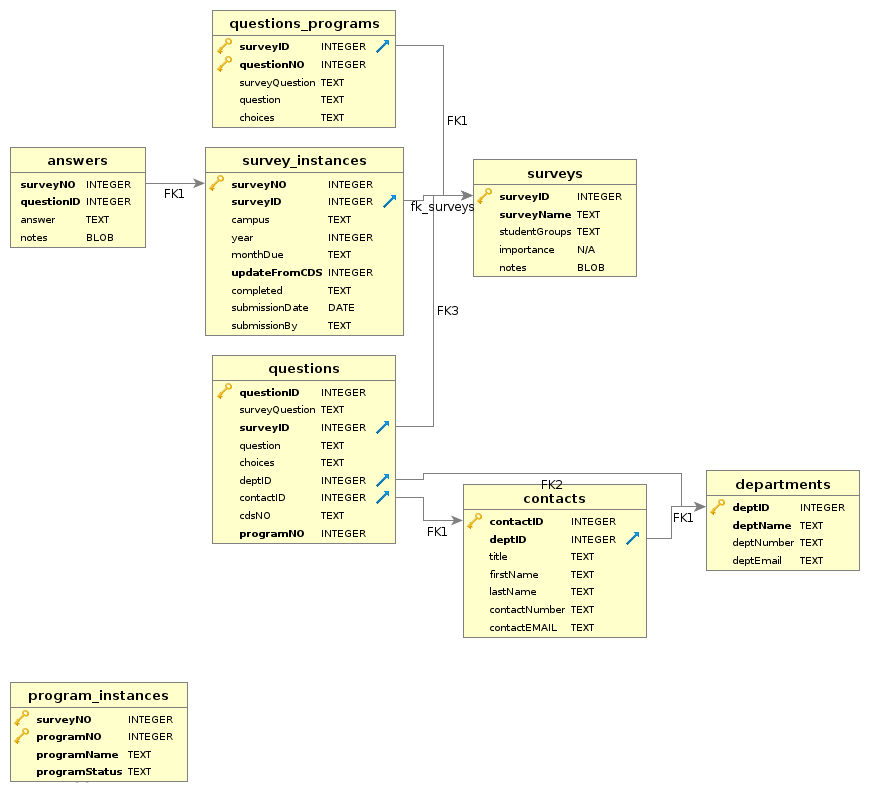

# Part I: Overview

## Setup

### Software

To work with the Surveys Database you will need to install 2 pieces of software:

1. Download and install sqlite3 tools at:
<https://www.sqlite.org/download.html>
2. Download SQLiteStudio from:
<https://sqlitestudio.pl/>


##### 

#### sqlite3
sqlite is a self-contained simplified variety of SQL. It is used in countless applications due to it's simplicity and efficiency. A primary advantage is that there is no server process needed which means IT is not needed to configure sqlite and you will not need admin privleges when installing.

Once at the downloads page for sqlite3 (<https://www.sqlite.org/download.html>) you go to the precompiled binaries for windows and download the "sqlite-tools" zip file.

```{r echo=FALSE, fig.cap="sqlite Download Page", out.width = '25%'}

```

You wont be using these tools too often and primarily, if at all, as part of the "Advanced Uses" in part III. There will need to be some extra configuring for that but that is explained in Part III.

#####

#### SQLiteStudio

SQLiteStudio is a graphical interface to sqlite. This will be what you primarily work in and update. 

Download it from <https://sqlitestudio.pl/>

```{r echo=FALSE, fig.cap="SQLiteStudio Home Page", out.width = '25%'}

```

#####

### Getting Started

Once you have download both folders, go to your downloads folder and extract the files. After you have extracted the contents from both folders I suggest you make a new folder called SQLite and put both the unzipped folders in there and move that to your desktop or home folder so they are together. You can delete the zip files after extraction.

To open SQLiteStudio go to the SQLiteStudio folder and find the application.

```{r echo=FALSE, fig.cap="SQLiteStudio Folder", out.width = '25%'}

```

The application has a little like cylinder symbol next to it.

##### 

Once SQLiteStudio is open you can click that same little symbol that has a green plus sign on it to add the database. You can also copy the TestDB.db database file to your computer to mess around with more freely.


```{r echo=FALSE, fig.cap="SQLiteStudio", out.width = '25%'}

```

Navigate to the folder that has the database you want to use and it will show up in the left side databases pane. Click the name and the database structure will appear.

#####

## Database Structure


```{r echo=FALSE, fig.cap="ER Diagram", out.width = '100%'}

```

#####

### Tables

#### 1. surveys 

The surveys table is where you find/enter basic information about a survey. It has 5 columns: surveyID, surveyName, studentGroups, importance and notes. The surveyID is the table primary key and will be essentially the order surveys are added to the database, **no survey should appear more than once**. The surveyName tells the name of the survey. You can identify what students the survey asks about in the studentGroups column. The importance column is a nmumber from 1 to 5 with 1 indicating the survey is of high importance. Finally any notes may be added to the notes column.

#### 2. questions

The questions database is where all the questions will be stored for each survey in the surveys table. It is important to note that **questions cant be added to the questions table if there is no survey identifier in the surveys table. The questions table is linked to the surveys table by the surveyID column. 

In the questions table, each question has an unique questionID (which is the primary key). It is recommend that you take surveys in batches of 10,000s. So survey 1 starts at questionID 10000, survey 2 at questionID 20000, etc. In this qay you have 10,000 potential questions to add for a survey which should be enough in almost every situation. This can be changed of course but it's nice to have the surveyID match the first digits of the questionIDs for a survey. More is said about this in Part III.

The next column is surveyQuestion which is a survey specific label which is just based on how the survey orders questions. Next is the actual question, followed by what choices are provided. After that you have a columns deptID and contactID which link to the departments and contacts tables respectively. These columns identify what department and contact should be sent the question. 

The column labeled cdsNO is a column that matches the question to where it appears in the CDS (if it does at all). If a survey contains a CDS question (often it tells you what is) then entering that information here will allow the database to automatically pull that information from the current CDS.

Finally the programNO column links to the program_instances table (though not formally). This was a later addition as several surveys have repeating questions for a multitude of programs. More is mentioned below. Any survey without program components is given a programNO of 0.

Note: The questions table should be handled with care.

#### 3. survey_instances

Once a survey and it's questions are added to the database you can create instances of that survey. Each survey generally comes up once a year and will need a new instance each year. Each time a survey instance is added a copy of all the questions for that survey is created filled in with any answers from the previous year that exists or any indicated CDS answers.

Each survey gets a surveyNO which should just always increase by one. Then you need to identify the survey being created by the surveyID. After that you can indicate what campus this survey is for (as some surveys get repeated for different campuses), the year of the survey and the monthDue of the survey. There are also columns for whether or not the survey has been completed, when it was submitted and who submitted it.

There are a few situations where you may not want the survey to pull information from the current CDS (for example if you are creating an instance of the survey for just the Staten Island campus). In these cases you can stop the database from pulling in the CDS information by setting updateFromCDS to 0. This shouldnt be often and it will default to 1 so that CDS information is brought in.

#### 4. answers

The answers survey contains the answers to each survey instance created. It has a combined primary key that links it to both the survey instance and the question being answered by the surveyNO and questionID columns. In this way you can store several years of information from a single survey through the creation of multiple survey instances.


#### 5. departments

The departments table list information about which department we should get the answer for a survey from. The deptID is just an integer value that is the primary key. Then you can enter the deptName, phone number (deptNumber) and email of the department (deptEmail). All questions that dont have a known department to contact will default to deptID of 1 whihc is IR.


#### 6. contacts

Similar to the departments table, the contacts table gives information about the actual person who should answer each question. It contains columns for their title, first and last names, phone number and email. It includes a link to the departments table via the deptID column. Both the departments table and the contacts table are linked to the questions table so you can figure out who should answer each question.

Note: You should always give a contactID to the department in general.

#### 7. questions_programs

As mentioned, several surveys provide a series of questions that get asked in the exact same way to several programs or departments (such as Petersons DL and Graduate, also GMAC). Because new programs can be added each year these things needed to be handled separately from just the main survey questions. So the questions_programs table just contains questions that get sent to multiple places in a single survey. 

This table contains columns for the surveyID the program questions are connected with, the survey specific question numbering (surveyQuestion) the question itself and any choices for answers.

The **most important** column in this table is the **questionNO** column. For each survey, the questionNO column should start at 1 and go to the last question for the program. The surveyID with the questionNO create the primary key for the table. To clarify, if a survey requires ytou to send 10 questions to every chair at ST. Johns, you only need to enter those 10 questions into the questions_programs **once**. You create a program instance for each chair you would need these questions to go to.

#### 8. program_instances

The program_instances table just contains the surveyNO of the survey instance, the program number that you are adding for that program (should start at 1 and always increase by 1) and the programName. Each time you create a new program_instance, the database will add a copy of the program_questions into the questions table for the survey you are working on. 

Because of the complpicated way that the programs get added to the questions table (every year you may add a new program) you dont want to ever delete a program instance. Instead you can list it as **"INACTIVE"** if the program is no longer needed. This way you will know not to send out questions from it. The defulat is "ACTIVE".


#####

### Views

Database design makes a point to avoid duplicating information across multiple tables. So in the questions table you will find out that a question gets answered by deptID 8 but the find out what department that is you have to then go look it up in the departments table. This is efficient for the database but not convenient for the user.

Views are stored SQL queries that combine columns from multiple tables, filter them or arrange them. There are some written in there already and some that will be added as the need arises. For the most part you will be working with these views, you will use them to enter survey answers, find out which contact is in what department, export a list of questions for a given contact etc. The only changes to the written SQL statements you will need to make are numerical changes of the surveyNO or contactID.

Once you click on a View you can ignore the SQL query that comes up (with some exceptions) and click the data tab to see what the view gives you.

```{r echo=FALSE, fig.cap="contactList View", out.width = '10%'}
knitr::include_graphics("images/contactsView.png")
```

Here you see that the contactList view combines data from the departments and contacts tables so you can easily see who belongs where.

#####

The Views contained in this database as of writing are:

#### cdsView

This view shows all of the CDSs in the database.

#### contactList

This will combine the contact table with the department table so you can see who goes in what department clearly.

#### questionContact

The questionContact view will bring up the questions for each contact involed in a specified survey. You have to enter the surveyNO you want to use in the SQL query. More about this in Part III.

#### showSurveys

Show surveys will combine data from the surveys table and survey_instances table so you can clearly see what survey instances are in the database.

#### surveyAnswers

This is a primary view you will be using as it is how you will enter answers. You need to change the surveyNO in the SQL statement to bring up the survey you want to enter answers for.

#####

### Triggers

Triggers control the automation of the database. So when you enter a new survey instance into the survey_instances table, a trigger fires that sets up a new copy of the survey in the answers table bringing in last year's answers and current CDS answers.

You probably dont want to mess with any of the triggers without working on them with an administrator. Tinkering with a trigger will most likely destroy the database. As such I wont describe them here at this time other than to say avoid them.

#####

### Creating Backups

Probably the most important thing to know is how to make a backup of the database. Which is pretty easy.

To make a backup all you do is copy the SurveysDatabase.db file and save it somewhere else.

It is suggested to make a backup of the database **BEFORE** you go to start making changes to it. Just copy the file, save it to the backups folder with the date of the backup and then do what you got to do. Backups can be deleted yearly.


#####

# Part II: Basic Usage

The primary uses of the database will be:

1. Creating a new survey instance for a survey that already exists in the database.
2. Creating a new program instance for a survey that already exists in the database.
3. Entering new answers into the survey database.
4. Updating and keeping current the contacts and departments tables.

The above uses are considered "Basic" as they require no knowledge of SQL to complete. The main difficulty will be data integrity checks as new survey instances are created and the tedious entering of answers into the database.

## Survey Instances
The database is setup in such a way that the survey questions and choices are entered and added to the surveys table (see Part III). A survey needs to only be added once, each year when the new survey is sent to us (or however frequently) all you need to do is create is new "**survey instance**". 

A survey instance is basically a copy of the survey that is stored in the databases (if it exists in the surveys table). If there are any updates to a survey's questions then you can make those changes in the questions table.

For example, in the surveys table you will see that there exists a Long Island Business News survey (surveyID 6). Each survey should appear once in this table and connects to the questions table where the questions are stored for each surveyID. 

You will not be able to create a survey instance for a surveyID that does not exist in the surveys table.

```{r echo=FALSE, fig.cap="Surveys and Instances", out.width = '15%'}

```

When you make an entry in the survey instances table, the database will create a copy of the survey that is specific for the year you are filling out the survey. The surveys_instances table will have the same surveyID appear repeatedly but each time represents a different year (or period). In this example, surveyID 6, Long Island Business News, shows up twice as surveyNOs 11 and 12 for the years 2018 and 2019.

When a survey instance is created it will include the answers from last year's survey (if there is one) and current CDS answers that are marked as such if a current CDS exists (and if you flagged them to update).


#####

## SQLite Basics

Other than knowing what leads to what when you click on it, the other main thing you need to know is how to add data rows, delete data rows, and refresh. This is accomplished at the top of the data table.

```{r echo=FALSE, fig.cap="Survey 8", out.width = '25%'}

```

The green **plus** sign will add a new row for you to enter data into. The red **minus** will remove a selected row. Regardless of whether you are adding or removing a row, the action wont be saved until you hit the green **Checkmark**. Finally that first recylcying type symbol will refresh the data table you are looking at.

#####

## Program Instances

As mentioned, the surveys that require the same form to be filled out by multiple departments adds a level of difficulty. Since new programs can be added each year, programs needed to be able to be added straight into the questions table when needed. So program instances are used to accomplish this. 

For surveys that have program forms to be filled out, their questions should already exists in the questions_program table. The questions will exist in this table only once and will get copied to the main survey in the questions table upon creation of a program instance. Once you create the program instance, the database will automatically update the questions table.

While most surveys should have a main section to fill out before any programs, there may be some where no there is no main section to a survey (for example state surveys that we complete for Queens, SI and Manhattan separately). In these cases you can use any program as the main section, so it will need to exist first in the questions table.

**Note**: Program instances should not be deleted after they are created. The questions table for a survey is ordered by the questionID. Once a program instance is created, the database inserts the new program's questions in sequence with the main survey so deleting a program could mess up the order pretty badly. If a program ceases to exist you can just set the programStatus to INACTIVE. The execption to this would be if you delete the program instance immediately after you create it. In that case you delete the entry in the program_instances table and then have to delete the program questions that were added into the questions table. They should be the last one for


#####

If we look at survey questions for survey 8 Peterson Distance Learning EDU, in the questions table, you will see they end at 80037.

```{r echo=FALSE, fig.cap="Survey 8", out.width = '15%'}

```


#####

Now a new program instance is created to be added to the survey.

```{r echo=FALSE, fig.cap="Program Instances", out.width = '15%'}

```


#####

Now you can see the questions for survey 8 have been expanded by a program.

```{r echo=FALSE, fig.cap="New Questions", out.width = '15%'}

```

If you made a mistake here at creation time, then you can just delete the program instance entry and then delete these extra questions. If another program was added after this that you are keeping then you should not delete anything.


##### 

## Entering Answers

#####

## Updating contacts and departments

#####


# Part III: Advanced Usage

The more advanced uses of the database are:

1. Creating a new survey to add to the database that has not previously been added.
2. Exporting questions to several surveys to send to various contacts for updating.
3. Creating a pdf form of the questions to be sent out (Not Done in the Database).
4. Analyzing different trends in survey responses over the years.
5. Updating a survey with new questions

The above uses are considered "Advanced" as they require some minimal knowledge of SQL to complete or an ability to adapt previous SQL. In these cases, tasks should be completed with oversight by a handsome man in the administration.

## Creating A New Survey

Creating and adding a new survey (that is, a survey not listed in the surveys table), consists of three steps:

1. Write up the questions in a file with extension .sql (the longest/worst part)
2. Create a new survey entry in the surveys table
3. Use the command line to import the new questions into the questions table

### Writing survey questions

The SurveyQuestions folder has a template you can use for this or you can just copy an old survey file and alter that.

#### Before Writing Questions

The first thing you need to do is determine the survey number or surveyID of your new survey. This should be the next number in sequence based off of the surveys table.

```{r echo=FALSE, fig.cap="Surveys Table", out.width = '15%'}

```

Just use the next number (9 in the above as your new surveyID). After that you need to determine the starting questionID.

The questionID is probably the most important thing to worry about because if it gets messed up many issues can arise that wont be obvious.

For simplicity the questionID should be $surveyID \times 10000$. This allows each survey to have a maximum of 10,000 questions entered which should be plenty. You can of course start it somewhere else if somehow a survey had more than 10,000 questions but its helpful to have a pattern to go with.

You can always find the highest questionID in the database in the last entry of the questions table, but again you want to use a questionID far away from where the last survey ended in case new questions need to be added.

#### Opening Lines
The first line in the file must be: **PRAGMA foreign_keys=ON;**
This just makes sure table links (foreign keys) are active and turned on.

#### Initial Survey Question
The first survey question should generally have the following values entered: surveyQuestion (in quotes), questionID (a number), surveyID (a number), question (in quotes), choices (in quotes), cdsNO (in quotes). The surveyID and initial questionID are what you found above. The format is:

**INSERT INTO questions (surveyQuestion, questionID, surveyID, question, choices, cdsNO) VALUES (" ", , , " "," "," ");**

Technically you can leave out choices and cdsNO if the first survey question has no choices (it usually doesnt) and if there are no links to the CDS. Just make sure to remove the corresponding spaces in the VALUES vector.

The other important part is the surveyQuestion field. This will be specific to the survey you are entering and can be pretty felxible but does need to be unique. So one survey might call the first question A1, or the first question might in the contacts section of their survey and be the name of the primary contact, in that case you can use something like "C1.a" or "C1.1". Just be consistent with your system.


#### All Other Survey Question
After the initial line is written then you no longer need to enter a questionID, the database will increase the rest of the questions based off of your initial entry. So the rest of the lines can look like:

**INSERT INTO questions (surveyQuestion, surveyID, question, choices, cdsNO) VALUES (" ", , " "," "," ");**

Or if there are no CDS questions:

**INSERT INTO questions (surveyQuestion, surveyID, question, choices) VALUES (" ", , " "," ");**

**TIP** I find it easiest to always use the first version with both choices and cdsNO since it makes copy and pasteing easy.

#####

### Suggested Question Writing Method

#### Self Contained Questions
The most important thing when writing questions is to make sure they are self contained.

For example, look at this question

```{r echo=FALSE, fig.cap="Basic Example", out.width = '10%'}

```

This should be entered as 2 questions in the database:

**INSERT INTO questions (surveyQuestion, surveyID, question, choices) VALUES ("25a",surveyID , "Does your institution offer rolling admission for incoming first-year students","Yes; No");**

**INSERT INTO questions (surveyQuestion, surveyID, question, choices) VALUES ("25b",surveyID , "Does your institution offer rolling admission for incoming first-year students: Stipulations/Comments/Other","");**

In this way the second question is still clear and doesnt need the first question to understand.

#### Choices
I prefer to enter choices separating each choice with a semi-colon ;. This is not important but its how I do them

#### Entering Table data

Table data can be annoying to enter, for example question C9 has 4 tables to fill in, the second is this

```{r echo=FALSE, fig.cap="Table Example", out.width = '10%'}

```

I generally try and enter questions column by column so I would enter this as:

**INSERT INTO questions (surveyQuestion, surveyID, question, choices) VALUES ("C9.B1",surveyID , "Percentage of first-time, first-year (freshman) students with scores in rangte 700-800: SAT Evidence-Based Reading and Writing","");**

**INSERT INTO questions (surveyQuestion, surveyID, question, choices) VALUES ("C9.B2",surveyID , "Percentage of first-time, first-year (freshman) students with scores in rangte 600-699: SAT Evidence-Based Reading and Writing","");**

**INSERT INTO questions (surveyQuestion, surveyID, question, choices) VALUES ("C9.B3",surveyID , "Percentage of first-time, first-year (freshman) students with scores in rangte 500-599: SAT Evidence-Based Reading and Writing","");**

**INSERT INTO questions (surveyQuestion, surveyID, question, choices) VALUES ("C9.B4",surveyID , "Percentage of first-time, first-year (freshman) students with scores in rangte 400-499: SAT Evidence-Based Reading and Writing","");**

**INSERT INTO questions (surveyQuestion, surveyID, question, choices) VALUES ("C9.B5",surveyID , "Percentage of first-time, first-year (freshman) students with scores in rangte 300-399: SAT Evidence-Based Reading and Writing","");**

**INSERT INTO questions (surveyQuestion, surveyID, question, choices) VALUES ("C9.B6",surveyID , "Percentage of first-time, first-year (freshman) students with scores in rangte 200-299: SAT Evidence-Based Reading and Writing","");**

Then I would enter the math column, increasing the numbers (Note the B I used is because this was the second table in question C9)

**INSERT INTO questions (surveyQuestion, surveyID, question, choices) VALUES ("C9.B7",surveyID , "Percentage of first-time, first-year (freshman) students with scores in rangte 700-800: SAT Math","");**

**INSERT INTO questions (surveyQuestion, surveyID, question, choices) VALUES ("C9.B8",surveyID , "Percentage of first-time, first-year (freshman) students with scores in rangte 600-699: SAT Math","");**

**INSERT INTO questions (surveyQuestion, surveyID, question, choices) VALUES ("C9.B9",surveyID , "Percentage of first-time, first-year (freshman) students with scores in rangte 500-599: SAT Math","");**

**INSERT INTO questions (surveyQuestion, surveyID, question, choices) VALUES ("C9.B10",surveyID , "Percentage of first-time, first-year (freshman) students with scores in rangte 400-499: SAT Math","");**

**INSERT INTO questions (surveyQuestion, surveyID, question, choices) VALUES ("C9.B11",surveyID , "Percentage of first-time, first-year (freshman) students with scores in rangte 300-399: SAT Math","");**

**INSERT INTO questions (surveyQuestion, surveyID, question, choices) VALUES ("C9.B12",surveyID , "Percentage of first-time, first-year (freshman) students with scores in rangte 200-299: SAT Math","");**

Finally some tables really arent tables:

```{r echo=FALSE, fig.cap="Table-Like Example", out.width = '10%'}

```

This is really just 4 questions where your choices would be "Required; Recommended; Neither"

#### Other Tips

1. Certain questions will be separate in the survey but dont need to be in the database. For example, a survey will often have like 5 questions for entering an address, you can just make an address question. Same thing happens with phone numbers, there will be a question for area code, then another for phone number. You can make that one question.

2. It is not necessary to end every question with a question mark. I generally dont use them at all.


#####


# Part IV: Some Definitions

#### Primary Key

#### Foreign Key

#### Survey Instance

#### Program Instance

#### SQL
